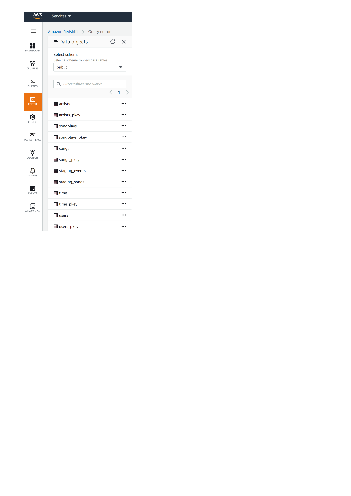

**Cloud data warehouse for Sparkify Data**

**About Project**

This project aims to Analyze a startup called Sparkify. THey've been collecting  songs and user activity on their new music streaming app.Their data resides in S3,in a directory of JSON logs on user activity on the app, as well as a directory with JSON metadata on the songs in their app.
My role was to building an ETL pipeline that extracts their data from S3, stage them in Redshift, and transforms data into a set of fact and dimensional tables for their analytics team to continue finding insights in what songs their users are listening to.

**Project Template**

This project contains these files:
1.dwh.cfg to store configuration files.
2.create_tables.py drops and creates tables.
3.etl. py reads and processes files from song_data and log_data and loads them into your tables.
5.sql_queries.py contains all queries .

**Database design**

Star schema database design is used because of its simplicity and efficiency for defining fact and dimension tables.The database consist of the following tables:
   
**Staging Tables** 

  - Staging events (Load log dataset)  
  - Staging songs (Load songs dataset)

**Fact Table** 

- songplays - The fact table. with following attributes
songplay_id, start_time, user_id, level, song_id, artist_id, session_id, location, user_agent 

**Dimension Tables**

- users -Dimensional table extracted from log_data files. with the following attributes user_id, first_name, last_name, gender, level
- songs -Dimensional table extracted from song_data files. With the following attributes song_id, title, artist_id, year, duration
- artists -Dimensional table extracted from song_data files. With the following attributes artist_id, name, location, latitude, longitude 
- time -Dimensional table extracted from Timestamp column. with the following attributes start_time, hour, day, week, month, year, weekday

**Run Pipeline**

The following instructions are to run the pipeline :

1.Run IaC file and ensure the cluster is up and running.

2.Run create_tables.py to create tables.

3.Run etl. py.

4.Go to Amazon Redshift > Cluster > Query Editor> Preview Data to make sure all the tables were successfully created and data were loaded into it.

5.Clean up cluster and resources.

**Refrences:**

[Create AWS Redshift cluster using AWS python SDK](https://shravan-kuchkula.github.io/create-aws-redshift-cluster/#step-4-load-partitioned-data-from-s3-into-the-table-just-created)
[Getting Started with Amazon Redshift
](https://aws.amazon.com/redshift/getting-started/?p=rs&bttn=hero&exp=b)[Redshift Epochs and Timestamps](https://www.fernandomc.com/posts/redshift-epochs-and-timestamps/)
